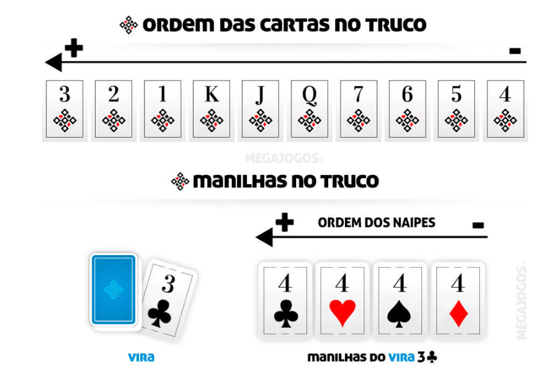

# Truco

## Regras

* Participantes: Número pares de jogadores até 6;
* Baralho: Retirar as cartas 8,9,10 e Joker;
* Distribuição de cartas: três cartas para cada jogador;
* Objetivo: Fazer 12 pontos;

**Glossário do Truco**

* Manilhas: As cartas que valem mais em cada rodada respeitando a sequência de naipes, do maior para o menor: ♣ Paus, ♥ Copas, ♠ Espadas e ♦ Ouros.

* Vira: A carta que é virada para definir quais serão as manilhas.

* Rodada: Uma sequência de 4 jogadas, onde cada jogador joga uma carta.

* Mão: Composta de duas a três rodadas, e vale inicialmente 1 ponto.

* Pedir Truco (trucar), Seis, Nove ou Doze: Proposta para subir o valor de pontos da mão - pode ser para 3, depois para 6, 9 e finalmente para 12.

* Mão de 11: Quando uma das duplas está com 11 pontos.

* Mão de ferro: Quando as duas duplas estão com 11 pontos.

* Carta coberta: Carta jogada virada (com a face voltada para baixo), que não vale nada.

***Como jogar***

1. Após embaralhar, distribua 3 cartas para cada jogador no sentido horário iniciando pelo jogador a sua esquerda.

2. Ao final da distribuição de cartas, revele a carta do topo do monte - a vira, deixando-a sempre visível.

3. As manilhas são as cartas seguintes à vira, de acordo com a ordem das cartas do Truco.
- Exemplos: se a vira for 6, as cartas de número 7 serão as manilhas; se a vira for 7, a manilha são as Q; se a vira for 2, a manilha será o 3.
  As 4 manilhas são as cartas que valem mais durante esta rodada, seguindo a ordem dos naipes das manilhas - nas cartas que não são manilhas o naipe não importa.

4. A seguir, inicia-se a primeira mão, formada por até 3 rodadas e que estará valendo 1 ponto.
   Nessa rodada, cada jogador deve jogar uma carta na mesa e a de maior valor ganha a rodada.
   Quando uma dupla vencer 2 rodadas, terá ganho os pontos da mão.

5. A qualquer momento, a partir do início da rodada, os jogadores podem pedir truco e assim aumentar o valor da mão.

6. As mãos são feitas sucessivamente, até que uma das duplas chegue a 12 pontos.

***A MÃO:***

A mão pode ter 3 rodadas. O jogador que jogar a carta mais alta vence a rodada, e a dupla que conseguir vencer duas rodadas leva a mão.

Caso empate a primeira rodada, o time que vencer a segunda rodada leva a mão. Caso empate a segunda rodada novamente, a equipe que vencer a terceira e última rodada levará a mão. Se todas as rodadas empatarem, nenhuma das duplas ganha ponto e uma nova mão se inicia.

A dupla que ganhou a primeira rodada levará a mão em caso de empate na segunda ou terceira rodada.

***ORDEM DAS CARTAS DO TRUCO***

Da carta mais forte de truco para a de menor força, temos o 3, 2, 1, K, J, Q, 7, 6, 5, 4. O naipe também gera interferência na força da carta para estabelecer o desempate.
Veja abaixo, a ordem de força das cartas e a força dos naipes na manilha:

- ♣ Paus (mais forte) - conhecidas como ZAP ou gato.
- ♥ Copas - copeta ou copilha.
- ♠ Espadas - espadilha
- ♦ Ouros (mais fraca) - chamadas também de mole ou pica-fumo.

